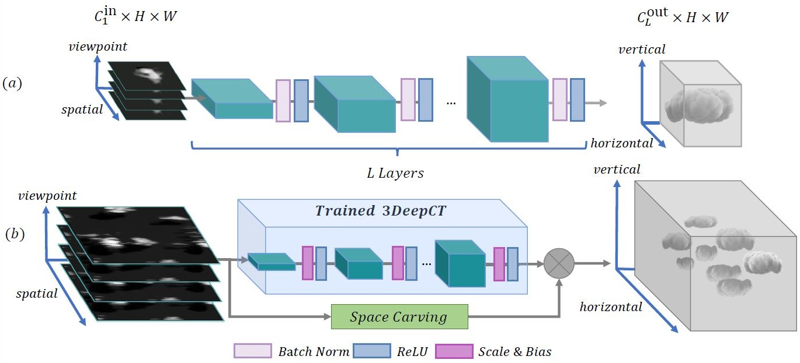

# 3DeepCT: Learning Volumetric Scattering Tomography of Clouds
[](https://openaccess.thecvf.com/content/ICCV2021/papers/Sde-Chen_3DeepCT_Learning_Volumetric_Scattering_Tomography_of_Clouds_ICCV_2021_paper.pdf)
## Abstract
We present 3DeepCT, a deep neural network for computed tomography, which performs 3D reconstruction of scattering volumes from multi-view images. 
The architecture is dictated by the stationary nature of atmospheric cloud fields.
The task of volumetric scattering tomography aims at recovering a volume from its 2D projections. This problem has been approached by diverse inverse methods based on signal processing and physics models. However, such techniques are typically iterative, exhibiting a high computational load and a long convergence time.
We show that 3DeepCT outperforms physics-based inverse scattering methods, in  accuracy, as well as offering orders of magnitude improvement in computational run-time. We further introduce a hybrid model that combines 3DeepCT and physics-based analysis. The resultant hybrid technique enjoys fast inference time and improved recovery performance.

https://user-images.githubusercontent.com/62201490/141940761-176296be-4fc0-4657-94a4-6439fe61267b.mp4

## Description
This repository contains the official implementation of 3DeepCT, a deep neural network for cloud-fields computed tomography.
At a high level, our method reconstruct 3D volumetric cloud-field from its multi-view perspective satellites images.



## Setup
### Requirements
* Anaconda

Start a clean virtual environment:

```
conda create -n 3DeepCT python=3.7.9
conda activate 3DeepCT
```

Install required packages:
```
conda install pytorch==1.7.1 torchvision==0.8.2 torchaudio==0.7.2 cudatoolkit=10.1 -c pytorch
pip install -r requirements.txt
```

## Usage
To train or test the model it is required to have a directory for your experiment under the experiments dir containing config.json file.
You can see an example in 3DeepCT\experiments\example.
 ### Training:
 
 `python train.py --exp_dir {EXP_DIR}`
 
 While training the model will be saved in {EXP_DIR} every {save_model_gap} epochs (from config.json file) under the name model_{epoch}.
 
 ### Evaluation:
 
 `python eval.py --exp_dir {EXP_DIR}`
 
 Evaluation will test the model specified in {model_path} from the config.json file.
 At the end of the evaluation, an evaluation_result.mat file will be saved in {EXP_DIR}.

### Data
The seven-clouds-subset used in the paper can be downloaded [here](https://drive.google.com/file/d/1_gLSckMLtNRd5yKovigAHyXg-dmDKR0Y/view?usp=sharing).

### Models
The 10 satellites trained model can be downloaded [here](https://drive.google.com/file/d/1Lks_o1bsw67PXZYRzXjLkH12X6yY8O9j/view?usp=sharing).

The 32 satellites trained model can be downloaded [here](https://drive.google.com/file/d/1hyASgf0WMyOAJfXR6NBnmd_SizBVk2H0/view?usp=sharing).


# Citation
If you make use of our work, please cite our paper:

```
@inproceedings{sde20213deepct,
  title={3DeepCT: Learning Volumetric Scattering Tomography of Clouds},
  author={Sde-Chen, Yael and Schechner, Yoav Y and Holodovsky, Vadim and Eytan, Eshkol},
  booktitle={Proceedings of the IEEE/CVF International Conference on Computer Vision},
  pages={5671--5682},
  year={2021}
}
```

Thanks to Eshkol Eytan for the clouds data we used to train and test out model.
If you are using the data please cite:
```
@article{eytan2021revisiting,
  title={Revisiting adiabatic fraction estimations in cumulus clouds: high-resolution simulations with a passive tracer},
  author={Eytan, Eshkol and Koren, Ilan and Altaratz, Orit and Pinsky, Mark and Khain, Alexander},
  journal={Atmospheric Chemistry and Physics},
  volume={21},
  number={21},
  pages={16203--16217},
  year={2021},
  publisher={Copernicus GmbH}
}
```


